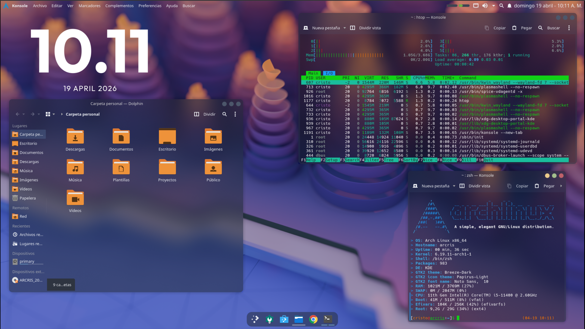

# KDE Plasma Theme 


Dotfiles para transformar Arch Linux con KDE Plasma en un entorno estilo macOS Ventura.

## Requisitos Previos

Debes tener **KDE Plasma instalado** en Arch Linux. Si aún no lo tienes:

```bash
sudo pacman -S plasma-meta kde-applications sddm
sudo systemctl enable sddm
```

## Actualiza el sistema

```bash
sudo pacman -Syu
yay -Syu
```

## Instalación

```bash
git clone https://github.com/CodigoCristo/KDE_MAC.git
cd KDE_MAC
chmod +x install.sh
./install.sh
```

El script copia automáticamente las carpetas `.config`, `.icons`, `.local` y `.var` a tu directorio home, fusionando el contenido con lo que ya exista sin eliminar tus archivos actuales.

Después de ejecutar el script, **reinicia tu sesión** para aplicar todos los cambios.

## Instalar kwin-effects-glass

Este efecto es necesario para los efectos de transparencia y blur estilo macOS. Instálalo desde AUR con `yay`:

```bash
yay -S kwin-effects-glass-git
```

> Si no tienes `yay` instalado:
> ```bash
> sudo pacman -S --needed git base-devel
> git clone https://aur.archlinux.org/yay.git
> cd yay
> makepkg -si
> ```

Reinicia tu sesión para aplicar los cambios.
